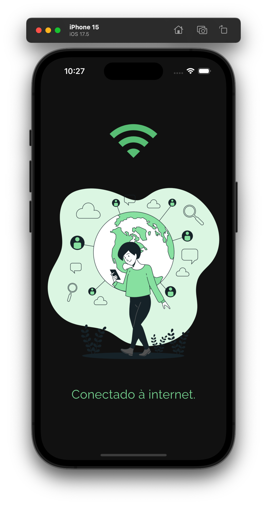
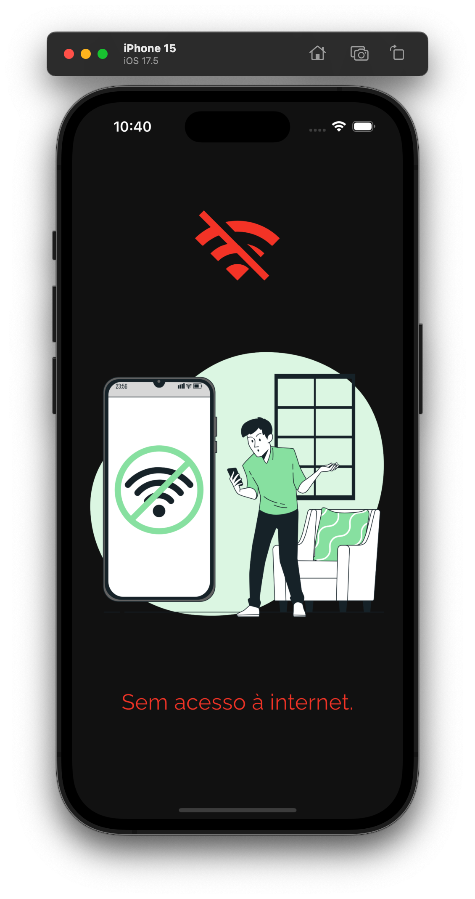

<h2 align="center">Connection Checker<h2>
<p align="center">
    
</p> 

   <h2>Topics 📋</h2>

  <p>
   
   - [About 📖](#about-)
   - [Preview 📱](#preview-)
   - [Technologies Used 👨🏽‍💻](#---technologies-used----)
   - [How to Use 🤔](#how-to-use-)
   </p>

   <h2>About 📖</h2>
   
   <p>
The connection checker was a project made for a specific setup to check the user's connection to the application in question. It uses Bloc for state management, and the connectivity plus package together with the internet connection checker to check whether or not the user has access to the internet. The project serves as a boilerplate for future use in upcoming projects, to reduce coding time with this ready-made template.
   </p>

---

   <h2>Preview 📱</h2><br>

   <p a>
      
       
   </p>

---

 <h2>
   Technologies Used 👨🏽‍💻
   </h2>
   
- **bloc** -> State Manager.
- **freezed** -> Code generator for bloc state and event classes.
- **connectivity_plus** -> Plugin that allows flutter apps to discover network connectivity types that can be used.
- **internet_connection_checker** -> A library designed for seamless internet connectivity checks. This library enables you to verify your internet connection.
  
---

   <h2>How to Use 🤔</h2>

```
- Clone this repository:
$ git clone https://github.com/Franciscof11/Connection_Checker.git Connection_Checker

- Enter in directory:
$ cd Connection_Checker

- For install dependencies:
$ flutter pub get

- Connect your emulator or physical device

- Run the app:
$ flutter run
```

---

This project was developed by **[@Francisco Gabriel](https://www.linkedin.com/in/franciscossg/)**,
if it helped you, give ⭐, it will help me too 😉.

---

   <div>

[](https://www.linkedin.com/in/franciscossg/)

   </div>

